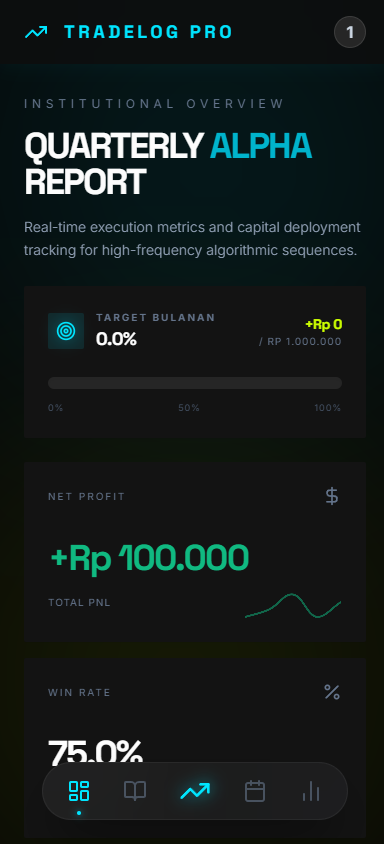
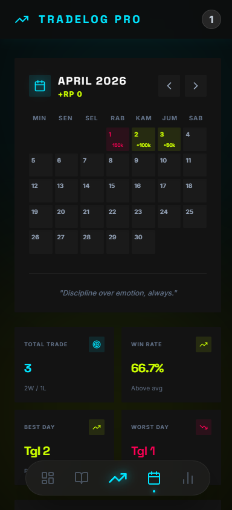
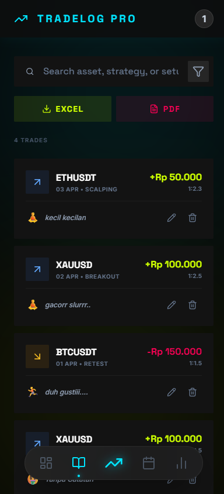
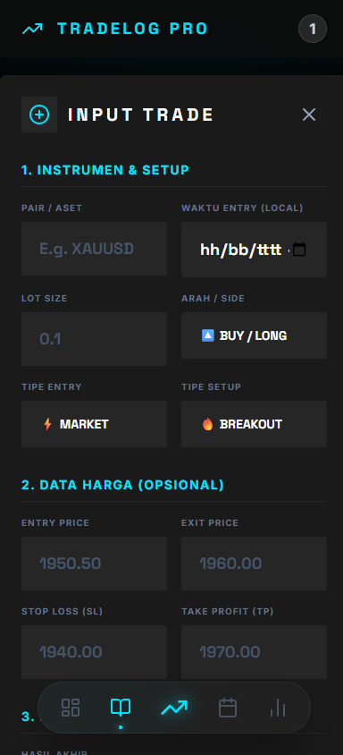
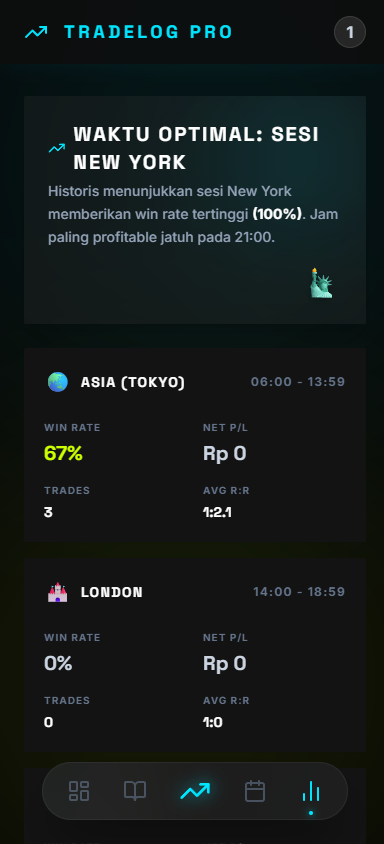

# 📈 TradeLogPro

> Institutional-grade trading journal with real-time analytics, cloud sync, and a premium dark UI.



## 🚀 Overview

**TradeLogPro** is a high-performance trading journal application designed for professional traders. Built with the **"Institutional Ghost"** design system — a minimalist, high-contrast dark theme featuring tonal surface separation, neon accent colors, and precision typography — it delivers an immersive experience that feels like a professional trading terminal.

Track performance, analyze setups, maintain discipline, and export reports — all from a single, beautiful interface.

## ✨ Key Features

### 📊 Dashboard & Analytics
- **Real-time P&L Tracking** — Net Profit, Win Rate, Profit Factor, and Total Trades at a glance
- **Sparkline Trends** — Micro charts embedded in every stat card for instant visual context
- **Capital Growth Chart** — Interactive line chart tracking portfolio equity curve over time
- **Win Rate Doughnut** — Visual breakdown of Win / Loss / Break-Even distribution
- **Monthly Target Progress** — Horizontal progress bar with glowing neon tip indicator
- **Time-Based Analysis** — Hourly performance heatmap to identify optimal trading sessions

### 📅 Calendar
- **Heatmap Calendar** — Color-coded daily P&L on a monthly grid (green = profit, red = loss)
- **Monthly Stats Summary** — Total trades, win rate, best day, worst day
- **Streak Counter** — Current winning/losing streak with fire/ice emoji indicators
- **Daily P&L Bar Chart** — Native mini bar chart with hover tooltips
- **Recent Trades** — Latest 5 trades of the month displayed inline

### 📝 Trade Journal
- **Comprehensive Trade Entry** — Asset, Setup, Side (Long/Short), Entry/Exit Price, Lot Size, R:R, P&L
- **Discipline Checklist** — Mandatory setup & risk confirmation before every trade submission
- **Mood/Psychology Tracker** — Log emotional state per trade (Calm, Patient, Greedy, Fear, FOMO)
- **Search & Filter** — Full-text search + outcome/setup/side filters with active filter indicators
- **Export** — One-click export to **Excel** (.xlsx) and **PDF** with auto-formatted tables
- **Trade Detail Modal** — Full breakdown view of any individual trade

### ⚙️ Settings & Auth
- **Firebase Authentication** — Secure email/password login and registration
- **Currency Selection** — IDR, USD, EUR, JPY with proper formatting
- **Monthly Target Config** — Set and track monthly profit goals
- **Quick Logout** — Log-out button accessible directly from Settings

## 📸 Preview

| Trading Calendar | Trade History |
|:---:|:---:|
|  |  |

| Input Trade | Session Analysis |
|:---:|:---:|
|  |  |

## 🎨 Design System — "Institutional Ghost"

The UI follows a custom design system built for maximum readability and minimal distraction:

| Token | Value | Usage |
|---|---|---|
| `background` | `#050505` | App background — deep midnight |
| `surface` | `#0e0e0e` | Base card surface |
| `surface-container-low` | `#131313` | Elevated cards & panels |
| `surface-container` | `#1a1a1a` | Secondary containers |
| `surface-container-highest` | `#262626` | Inputs, hover states |
| `primary` | `#00E5FF` | Cyan neon — primary actions & accents |
| `success` | `#CCFF00` | Lime neon — profit, wins, positive |
| `danger` | `#FF0055` | Vivid rose — loss, errors, destructive |

### Typography
- **Headlines**: *Space Grotesk* — Bold, uppercase, tight tracking
- **Body/Labels**: *Inter* — Clean, readable, professional
- **Data/Code**: *JetBrains Mono* — Monospaced precision

### Design Principles
- **No-Line Rule**: Borders replaced with tonal surface separation and subtle shadows
- **Sharp Corners**: `rounded-sm` throughout — no rounded pills or circles (except intentional elements like avatars)
- **Neon Glow Accents**: Strategic `drop-shadow` and `box-shadow` on primary elements
- **Glass Panels**: Backdrop blur on overlays and navigation

## 🛠️ Technology Stack

| Layer | Technology |
|---|---|
| **Framework** | React 19 + TypeScript |
| **Build Tool** | Vite 7 |
| **Styling** | Tailwind CSS 3.4 (Custom Config) |
| **Icons** | Lucide React |
| **Charts** | Chart.js via `react-chartjs-2` |
| **Database** | Firebase Firestore (Real-time sync) |
| **Auth** | Firebase Authentication |
| **PDF Export** | jsPDF + jspdf-autotable |
| **Excel Export** | SheetJS (xlsx) |

## ⚡ Getting Started

### Prerequisites

- Node.js (v18 or higher)
- npm or yarn

### Installation

1. **Clone the repository**
   ```bash
   git clone https://github.com/yourusername/tradelogpro.git
   cd tradelogpro
   ```

2. **Install dependencies**
   ```bash
   npm install
   ```

3. **Configure Environment**
   Create a `.env` file in the root directory and add your Firebase configuration:
   ```env
   VITE_FIREBASE_API_KEY=your_api_key
   VITE_FIREBASE_AUTH_DOMAIN=your_project.firebaseapp.com
   VITE_FIREBASE_PROJECT_ID=your_project_id
   VITE_FIREBASE_STORAGE_BUCKET=your_storage_bucket
   VITE_FIREBASE_MESSAGING_SENDER_ID=your_sender_id
   VITE_FIREBASE_APP_ID=your_app_id
   ```

4. **Run the development server**
   ```bash
   npm run dev
   ```

## 📂 Project Structure

```
src/
├── components/
│   ├── Analytics/     # Time-based analysis heatmap
│   ├── Auth/          # Login & Registration forms
│   ├── Calendar/      # Trading calendar, monthly stats, streak, bar chart
│   ├── Charts/        # Growth chart, Win rate doughnut
│   ├── Common/        # Modal, ConfirmDialog (shared components)
│   ├── Dashboard/     # StatsCards, TargetProgress
│   ├── Layout/        # TopNav (Sidebar), Floating BottomNav, Layout shell
│   ├── Settings/      # Settings modal with currency, target, logout
│   └── Trades/        # TradeList, TradeFormModal, TradeDetailModal
├── context/           # React Context (AuthContext)
├── lib/               # Firebase configuration
├── types/             # TypeScript interfaces (Trade, UserSettings)
└── utils/             # Helper functions (formatCurrency, export utils)
```

## 🤝 Contributing

Contributions are welcome! Please feel free to submit a Pull Request.

## 📄 License

This project is licensed under the MIT License - see the [LICENSE](LICENSE) file for details.

---

<center>
  <p>Made with ❤️ by <b>Jackie</b></p>
  <p><i>"Consistency is the key to trading mastery."</i></p>
</center>
